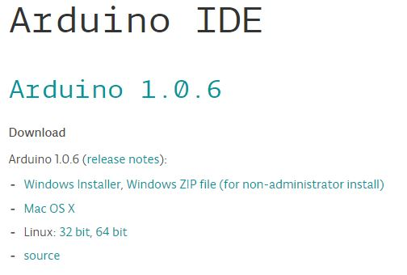
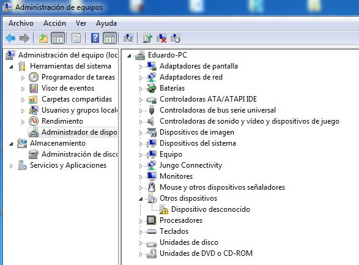
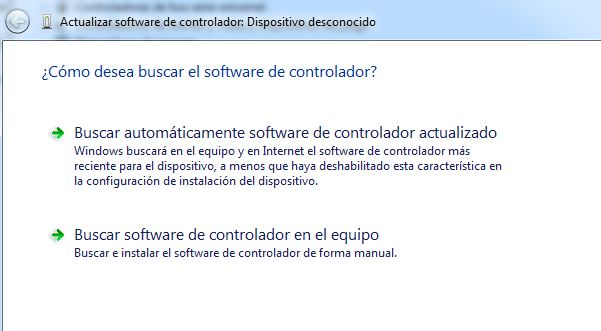
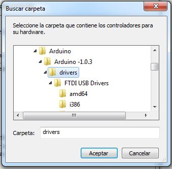

#Si es la primera vez que usas arduino, esta mini-guía te va a ser bastante útil 

***
Y aquí vamos...  

###Primer paso: Descargar el software
Para eso puedes dirigirte directamente a la página de arduino y descargar la versión que más te guste que sea compatible con tu sistema operativo.

El link es el siguiente: <http://arduino.cc/en/Main/Software>

Aquí debes seleccionar tu sistema operativo. Si eres usuario de Windows, te recomiendo que escojas Windows ZIP file, para que puedas guardarlo en un USB y ejecutarlo en cualquier computadora a donde vayas (Otra ventaja es tener las carpetas de librerías directamente allí, para agregar nuevas con facilidad, sin rebuscar entre las carpetas del sistema). 
Descomprímelo y guarda la carpeta en una ubicación que recuerdes.

###Segundo paso: Actualizar los drivers

En la carpeta que descargaste hay una llamada drivers. Ahora abre el Administrador de Dispositivos y conecta tu Arduino. Si no lo reconoce, debe aparecer un nuevo Dispositivo desconocido.

Dale clic derecho y escoge Actualizar software de controlador

Seleccione la opción Buscar software en el equipo

Clic en Examinar y ubique la carpeta Drivers dentro de la carpeta de Arduino

Aceptar y listo. La PC debe reconocer ahora el Arduino. Dicho sea de paso, este procedimiento sólo debe ser ejecutado una vez por cada computadora.

###Tercer paso 

Servir y disfrutar. Digo, compilar y grabar. Mucha suerte para los que recién comienzan! (en realidad, google les será más útil que toda la suerte del mundo :)  
Saludos!